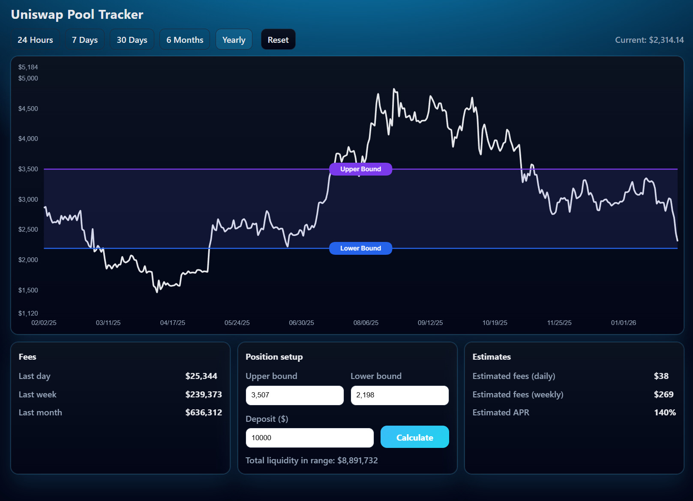

# Uniswap V3 Liquidity Pool Dashboard

An interactive full-stack dashboard for analyzing Uniswap V3 liquidity pools, focused on
price behavior, fee generation, and liquidity-range–based return estimation.

This project is designed as a **data-driven LP analysis tool** and a **portfolio-grade full-stack application**.

---

## 📸 Webpage



*Neon-themed Uniswap V3 dashboard with draggable liquidity bounds and liquidity-based fee estimation.*

---

## ✨ Features

### 📈 Interactive Price Chart
- Real-time ETH price visualization
- Draggable **upper / lower liquidity bounds**
- Zoomable Y-axis
- Cursor price inspection

### 💰 Fee Analytics
- Fees generated:
  - Last day
  - Last week
  - Last month
- Derived from historical Uniswap V3 pool snapshots

### 📊 Liquidity-Based Return Estimation
- Calculates **total liquidity within a selected price range**
- Estimates:
  - Daily fees
  - Weekly fees
  - Annualized APR
- Estimation is proportional to:

```
user_deposit / total_liquidity_in_range
```

---

## 🧠 How Fee Estimation Works

1. Aggregate liquidity (`usdValue`) from all ticks whose price range overlaps
   the selected LP bounds.
2. Compute the user's share of liquidity:

```
share = deposit / total_liquidity_in_range
```

3. Estimate returns:
- Weekly fees = `share × pool_fees_last_7_days`
- Daily fees = `weekly / 7`
- APR (%) = `(pool_fees_last_7_days / total_liquidity) × 52 × 100`

---

## 📦 Data Notes

- Pool data is fetched from **The Graph (Uniswap V3 subgraph)**
- Generated JSON data is ignored in version control by default
- Data can be regenerated via backend fetch scripts

---

## 🔮 Future Improvements
- Multiple pool selection
- Active-range fee attribution
- Liquidity depth visualization
- Persisted positions
- Cloud deployment

---

## 📜 License
MIT
